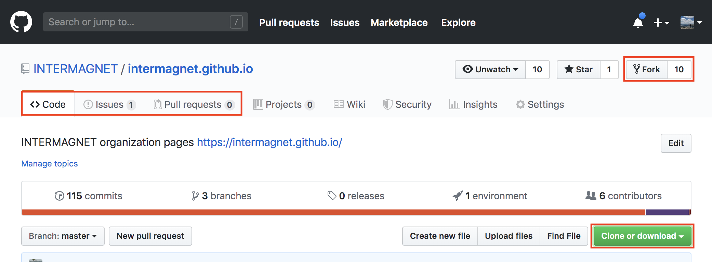
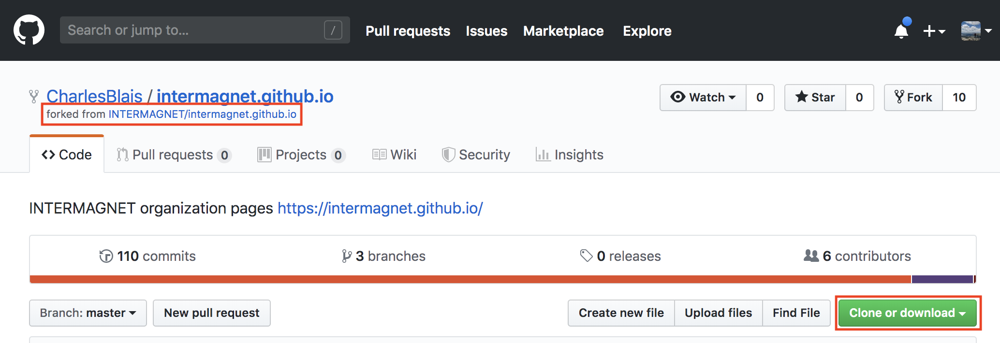

# Git Workflow

The Git workflow is a process is designed to avoid many problems that occur when many people are contributing to the same project, and make it easier to resolve unavoidable problems when they occur.


## Git and GitHub

Git is a distributed version control system that is widely used for many projects, software and otherwise.  It does not require a central server, and includes the full history for any project.

- https://git-scm.com/book
- https://git-scm.com/doc

GitHub provides a central *hub* where git repositories can be shared.  It also provides access control, and allows *pull requests* so changes can be reviewed before they are incorporated.


## Getting Started


### Setup

> This happens once to set up your account and computer.

- **create a GitHub account at https://github.com/**

  Once you've created a GitHub account, you can make simple changes.  See this page for more information: https://help.github.com/en/articles/editing-files-in-your-repository

  The repository is located here:

  https://github.com/INTERMAGNET/intermagnet.github.io


- (Optional) For more complex changes, we recommend using a local copy of the web site
based on the forking workflow described below.  You will also need to install and configure git on your local computer.

  The git book includes the steps to install and configure git, and provides a lot of detail. https://git-scm.com/book/en/v1/Getting-Started


## Forking workflow

These are two external guides that provide many more details than this document, and are good references.  You can find others by searching for "git forking workflow" and other distributed workflows.

- [GitHub forking workflow](https://guides.github.com/activities/forking/)

- Atlassian also provides a good description of this workflow for their bitbucket.org system that is very similar to github.com, and is a good alternative reference.  https://www.atlassian.com/git/tutorials/comparing-workflows/forking-workflow


### Repository Setup

> This happens once for each new project you are working with.

#### Fork repository (from official "upstream")

This step creates a personal copy of the official repository, *in your personal area on GitHub* where you can share any desired changes.  The official repository is usually referred to as the `upstream`, where new changes can be found.

The INTERMAGNET website `upstream` repository is https://github.com/INTERMAGNET/intermagnet.github.io .

To *Fork* the repository, click the Fork link and follow the steps to fork into your account.

  <figure>
    
    <figcaption>
      <small>Screenshot of intermagnet.github.io repository.</small>
      <br/>
      Note the links to `Fork`; `Clone or download`; and `Code`, `Issues`, and `Pull Requests`.
    </figcaption>
  </figure>


#### Clone fork (from your "origin")

This step creates a personal copy of the official repository, *on your computer* where you can make changes before *uploading to your fork* to submit a pull request.

You can run this command (note that `{USERNAME}` should be replaced with your GitHub username) from a command prompt or GitBash prompt.  By default it creates a directory with the project name (in this case `intermagnet.github.io`).

```bash
git clone https://github.com/{USERNAME}/intermagnet.github.io
```

  <figure>
    
    <figcaption>
      <small>Screenshot of fork of intermagnet.github.io repository.</small>
      <br/>
      Note the `Forked from ...` and `Clone or download` links.
    </figcaption>
  </figure>


#### Add the `upstream` Remote

When you clone a repository, and `origin` remote (pointing to your fork) is automatically created for you.  This step adds a remote for the offical repository, most commonly called `upstream`.

```bash
cd intermagnet.github.io
git remote add upstream https://github.com/INTERMAGNET/intermagnet.github.io
```

> You can list existing remotes and urls by running `git remote -v`.


### Checking for updates ("rebasing")

> This happens regularly, to make sure you have the latest view of the "upstream".

https://www.atlassian.com/git/tutorials/merging-vs-rebasing


#### check for updates

When you first fork a repository, it is up to date because it was copied.  Over time, other contributors changes will appear in the upstream remote and you need to regularly check for these updates to make sure other users haven't already made the same change.

This happens so frequently that I have added a bash function to my command line profile to perform the repeated steps by running `rebase`:

```bash
## rebase local master branch against upstream
# - switch to master branch
# - pull from upstream with --ff-only
# - push to origin master
rebase() {
  git checkout master && \
  git fetch --all && \
  git pull --ff-only upstream master && \
  git push origin master
}
```


### Working

Branches are used to avoid conflicts when multiple people are working on the same project.

> **The local master branch is used only for synchronization with the upstream remote.  Any new content should be added in feature branches.**  However, it is not unusual to accidentally commit changes to the master branch.  See below for more information


#### Create a new branch

You can create a branch from any other branch by running the command

```bash
git checkout -b *my-new-feature*
```

#### Make changes

Git tracks filesystem changes, and you can use any editor that helps you accomplish the task.

One editor that is convenient for many tasks is [Visual Studio Code](https://code.visualstudio.com/).


#### See what has changed

- To see files that have changed use the status command:

```bash
git status
```

Pay close attention to what you think should have changed, and what *should not* have changed.

- To see differences in changed files use the diff command:

```bash
git diff
```


### Save changes

#### Add files

Tell git which files you want to commit, you do not have to commit all changes at one time.

```bash
git add FILE-OR-DIRECTORY
```

> `git add -i` is an interactive version of git add that can be used to commit
> a subset of changed files and directories.


#### Commit changes

Persist changes as a new commit.

```bash
git commit -m 'Commit message describing change'
```

> `git commit -am 'Commit message'` includes *all* modified files; that were already tracked.
> **New files must be `git add`ed before commit.**


### Submitting changes

#### Push changes to your fork

```bash
git push origin *my-new-feature*
```


#### pull request

This makes the request for your changes to be *pulled*, or added, to the website.

See the Pull Request section of the github documentation for more details about
how to create the pull request:

https://guides.github.com/activities/forking/


## Frequently Asked Questions

### Accidental commit to `master`

This happens regularly, so don't worry about it if it happens!

- Create a new branch saving your changes
```bash
git checkout -b *new-feature*
```

- Reset the master branch

This happens so frequently that I have added a bash function to my command line profile to perform the repeated steps by running `reset_master`:

```bash
## reset local master branch to upstream/master
# - delete existing local master branch
# - create new local master branch tracking upstream/master
reset_master() {
  git fetch --all && \
  git checkout -b temp_master && \
  git branch -D master && \
  git checkout -b master upstream/master && \
  git branch -D temp_master
}
```

- Switch back to the feature branch, push the changes, and create a pull request

```bash
git checkout *new-feature*
git push origin new-feature
```

Go to your fork and create a pull request.
