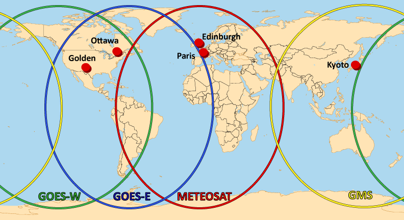

## GINs and Satellite Footprints

The Geomagnetic Information Nodes (GINs) are the collection points for real-time data within INTERMAGNET. They are connected to the INTERMAGNET observatories by satellite, computer and telephone networks. Minute mean observations of the earth's magnetic field are relayed to the GINs within 72 hours of recording. This time is substantially reduced when observatories are using satellite communications.

GINs are operating in:

- Edinburgh, United Kingdom - British Geological Survey
- Golden, United States of America - United States Geological Survey
- Kyoto, Japan - Kyoto University
- Ottawa, Canada - Geological Survey of Canada
- Paris, France - Institut de Physique du Globe de Paris

These GINs use the following satellites:

- GOES-E, covering East of the Americas
- GOES-W, covering West of the Americas
- METEOSAT, covering Europe and Africa
- GMS, covering Asia